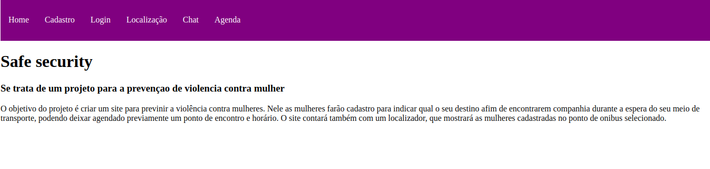
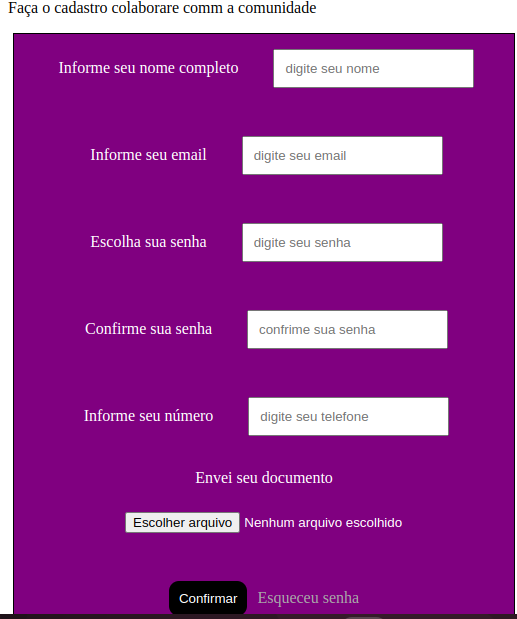
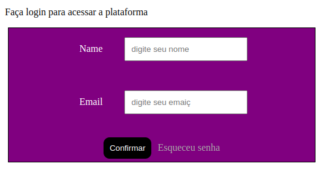
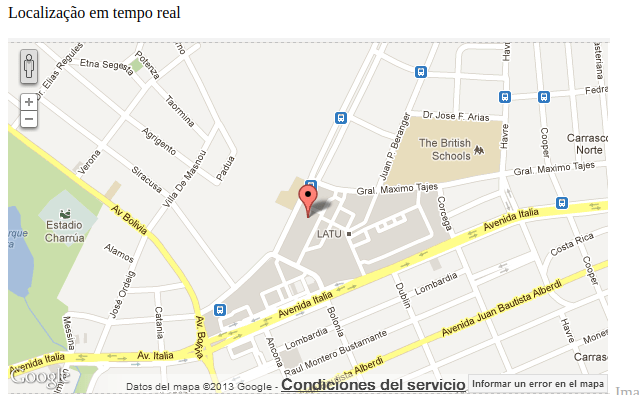

<h3>Projeto criado para o katie</h3>

O objetivo do projeto é criar um site para previnir a violência contra mulheres. Nele as mulheres farão cadastro para indicar qual  o seu destino afim de encontrarem companhia durante a espera do seu meio de transporte, podendo deixar agendado previamente um ponto de encontro e horário. O site contará também com um localizador, que mostrará as mulheres cadastradas no ponto de onibus selecionado.

Tecnologias utiizadas

React - react-router,  react-icons
Json-server - Simular o backend
Uuid - Gerar id

Projeto

